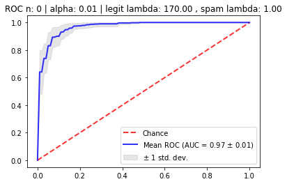

# ml_labs
Basic machine learning algorithms from scratch and few Neural Networks with tensorflow.

1. K-nearest neighbors algorithm
2. Linear regrssion
3. Support vector machines
4. Spam recognition
5. Sklearn DecisionTreeClassifier tests
6. Boost for decision trees
7. Neural Network recognition for MNIST dataset

color: #30D5C8

